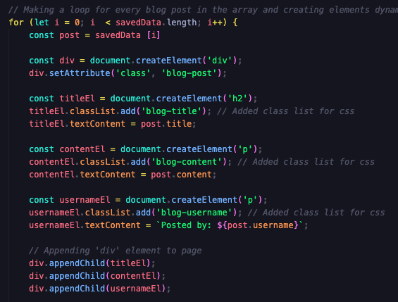

# personal-blog

## What Is A Blog Page?
* A blog page is a webpage displaying posts in chronological order, with the latest at the top. It includes titles, dates, and sometimes excerpts. Users can click to read full posts. It may have features like categories, search bars, and social sharing buttons. Typically, it includes widgets for related posts, recent comments, and author info. It serves as a platform for authors to share content and engage with readers.

## What Was The Problem With Web Page?
* The issue I encountered was related to storing data in the local storage of the user's browser using JavaScript. Despite attempting to save data, I faced challenges in ensuring its successful transmission and storage within the browser's local storage system.
* I encountered difficulty retrieving previously stored data from the local storage of the user's browser using JavaScript. Despite implementing methods to access this data, such as utilizing the ``localStorage.getItem()`` function, I struggled to successfully retrieve the desired information.
* I faced a challenge while attempting to implement a light-dark mode toggle feature using JavaScript. Despite my efforts to create a function that toggles between light and dark themes based on user interaction, I encountered obstacles that hindered the successful implementation of this functionality.
* One of the challenges I encountered involved retrieving data from the local storage of the user's browser and dynamically creating HTML elements based on this data using JavaScript. Despite attempting to retrieve the stored data and utilize it to generate elements within the webpage, I faced difficulties in seamlessly integrating these processes.
* Last problem was light-dark mode was working on the whole page, but not in the blog section.

## How Did I Solve The Problems?
* I made ``const`` for each inputs and datas,I added event listener for submit button with alert and pushed to local storage.
* 
* 
* I used local storage to save data from user input and then retrieved it when needed.
* I created ``elements`` with ``const`` and got from local storage with ``JSON.parse()`` method.
* 
* I made ``for`` loop for each input elements and created text content for value and used class list for add class names.
* 
* For toggle mode I stored ``currentTheme`` variable in the const and added to body with class list.When a button is clicked, its value will be assigned to current theme and saved into local storage.
*  

## What Did I learned?
* I learned  how to use event listeners for form submission.
* I also learned about using local storage to store data that needs to persist even if the browser is refreshed or closed.
* I learned about using ``localStorage`` to store data locally. 
* I learned that you can create elements dynamically by calling a function inside of another function.
* I also learned that you can add an attribute to an element by accessing its attributes property. 
* I learned how to make toggle mode for website.

## Links

* [Github Repository](https://github.com/veyselarslan12/personal-blog)

* [Deployment Website Link](https://veyselarslan12.github.io/personal-blog/)
